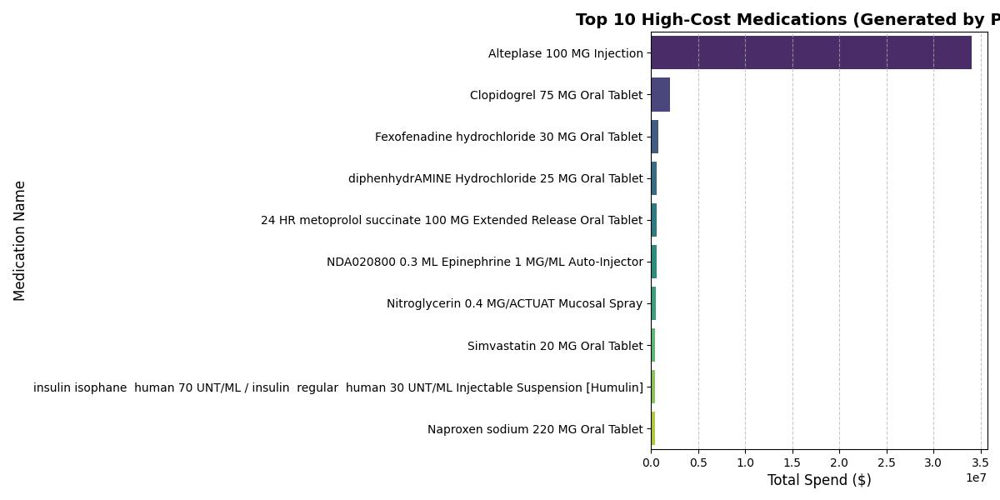
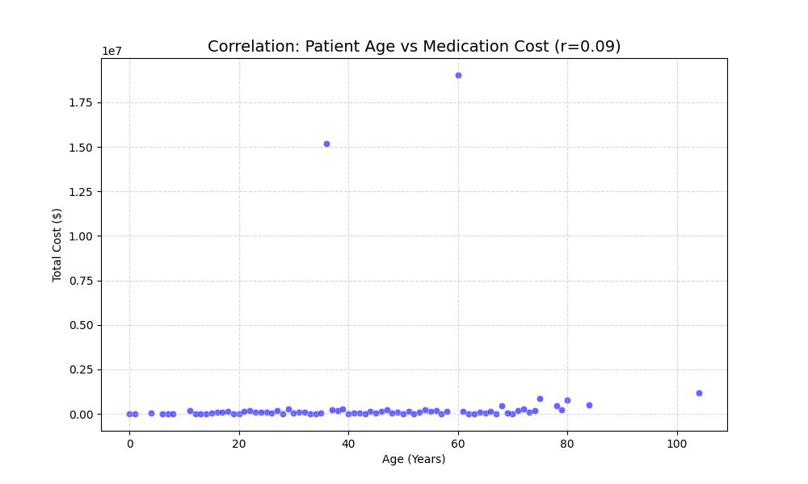
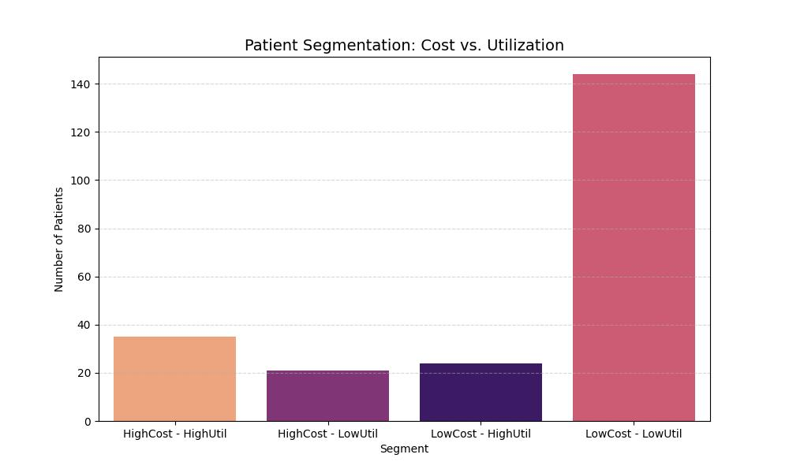

# Synthea Healthcare Analytics: End-to-End SQL & Python Pipeline


------------------------------------------------------------------------------------------------
## 🎯 Project Overview

### The Business Problem
Healthcare payers and providers face increasing pressure to balance **cost containment** with **quality of care**. Identifying high-cost drivers, utilization patterns, and disease burden is essential for financial sustainability and population health management.

### My Solution: A Hybrid Analytics Pipeline
As a **Pharmacist-turned-Data Analyst**, I designed an end-to-end pipeline that integrates **PostgreSQL** for robust data warehousing and **Python** for automated statistical analysis.

Unlike traditional workflows that rely on manual spreadsheet manipulation, this project demonstrates a **reproducible code-based approach**:
1.  **Ingest:** Synthetic EHR data (Synthea) is loaded into PostgreSQL.
2.  **Clean:** SQL performs heavy lifting (type casting, filtering, aggregation).
3.  **Analyze:** Python scripts connect to the DB via SQLAlchemy to calculate correlations.
4.  **Visualize:** Matplotlib & Seaborn generate automated reporting assets.

------------------------------------------------------------------------------------------------

## 🚨 Key Insight

### 1. The "Alteplase Anomaly" (Pareto Principle)
A Pareto analysis revealed a critical and non-intuitive finding:
* **76.93%** of total medication spend is driven by a single drug: **Alteplase (tPA)**.
* Utilization volume is extremely low (<1% of patients).
* **Business Implication:** Financial risk in this population is volatile and driven by **acute, catastrophic events** (e.g., stroke) rather than routine chronic disease maintenance.

### 2. The Age vs. Cost Paradox (Statistical Correlation)
Using Python to calculate the Pearson correlation coefficient between *Patient Age* and *Medication Cost*:
* **Correlation (r): 0.09 (Very Weak)**.
* **Clinical Interpretation:** Contrary to the assumption that "older age = higher medication cost," the data shows **no significant linear relationship**.
* **Root Cause:** The high cost of acute treatments (like Alteplase for stroke or Epinephrine for anaphylaxis) can occur across various age groups, disrupting the expected age-cost curve found in chronic care models.

------------------------------------------------------------------------------------------------

## 📐 Metric Definitions

To ensure analytical transparency, the following logic was applied to the data:

* **Total Medication Spend:** The sum of the `total_cost` column from the `mart.medications` table. This represents the total simulated financial cost for a drug across all occurrences.
* **Patient Age:** Calculated using the PostgreSQL `AGE(birthdate)` function. This represents the patient's **current age** at the time of analysis (runtime), derived from the `raw.patients` table.
* **Medication Cost (Per Patient):** Used in the correlation analysis; defined as the aggregate sum of all medication costs associated with a unique `patient_id`.
* **Medication Event:** Each row in `mart.medications` represents a single prescription/dispensing event generated by the Synthea engine.

------------------------------------------------------------------------------------------------

## ✅ Recommendations (Payer & Provider Strategy)

Based on the data insights—specifically the dominance of acute care costs (Alteplase) and the lack of age-based cost correlation—the following strategic actions are recommended:

* **Implement Stop-Loss & Reinsurance Strategies:** Since 76% of medication spend is driven by volatile, low-volume catastrophic events (Stroke/tPA), standard capitation models may fail. Payers should adopt specific stop-loss coverage to mitigate financial risk from these unpredictable acute claims.
* **Clinical Utilization Review (Stroke Protocols):** Providers should audit the administration of Alteplase. While high cost is expected for life-saving drugs, ensuring strict adherence to clinical inclusion/exclusion criteria avoids wasteful spending on non-compliant cases.
* **Shift from Age-Based to Diagnosis-Based Risk Adjustment:** The weak correlation ($r=0.09$) proves that age is a poor predictor of cost in this specific population. Actuarial models should shift to **HCC (Hierarchical Condition Category)** coding to better predict expenditure based on disease complexity rather than demographics.
* **Negotiate Value-Based Contracts:** For high-impact drugs like Alteplase, hospital procurement teams should explore value-based purchasing agreements where reimbursement is tied to patient outcomes (e.g., recovery metrics post-stroke) rather than volume alone.

*> **Note:** These recommendations are derived from synthetic Synthea™ data. In a real-world scenario, these strategies would require validation against local claims data, provider contracts, and clinical baselines.*

------------------------------------------------------------------------------------------------

## 🛠 Tech Stack & Skills Demonstrated

### Data Engineering & Storage
* **PostgreSQL 15:** Data warehousing, complex joins, and schema management (`raw` vs `mart`).
* **SQL:** Advanced querying, window functions (`SUM() OVER()`), and Type Casting (`::DATE`).

### Python Analytics (The "Brain")
* **Pandas:** Dataframes manipulation and statistical extraction.
* **SQLAlchemy/Psycopg2:** Secure database connectivity.
* **Seaborn & Matplotlib:** Programmatic data visualization.
* **NumPy:** Numerical computing.

### Environment
* **Tooling:** pgAdmin 4, VS Code/Terminal, Synthea (Java).
* **OS:** macOS. 

------------------------------------------------------------------------------------------------

## 📂 Project Structure

```text
synthea_portfolio/
│
├── data/                      # Raw CSVs from Synthea
│   └── raw/           
│
├── sql/                       # SQL Scripts for ELT
│   ├── 01_create_raw_tables.sql
│   ├── 02_data_quality_checks.sql
│   ├── 03_build_mart.sql
│   └── 04_analysis_queries.sql
│
├── src/
│   └── python/                # Python Automation Scripts
│       └── analysis.py        # Connects to DB -> Calcs Stats -> Plots Graphs
│
├── output/visualization/      # Generated Charts
│   ├── python_top_medications.jpg
│   └── python_age_cost_correlation.jpg      
│
└── README.md

------------------------------------------------------------------------------------------------

## 🛡️ Data Quality & Validation

To ensure the integrity of the analysis, a Data Quality (DQ) framework was applied using SQL. The following checks are executed in `sql/02_data_quality_checks.sql` before any Python analysis runs.

| DQ Dimension | Validation Check | SQL Logic Applied | Status |
| :--- | :--- | :--- | :--- |
| **Uniqueness** | Primary Key & Row Duplicates | `GROUP BY id HAVING COUNT > 1` | ✅ Pass |
| **Integrity** | Orphan Records (Referential) | `LEFT JOIN patients WHERE p.id IS NULL` | ✅ Pass |
| **Completeness** | Critical Fields (Null Checks) | `WHERE total_cost IS NULL` | ✅ Pass |
| **Validity** | Temporal & Logic | `BIRTHDATE > CURRENT_DATE` | ✅ Pass |
| **Consistency** | Negative Values | `WHERE total_cost < 0` | ✅ Pass |

------------------------------------------------------------------------------------------------

## 📊 Visual Analysis Results

### 1. High-Cost Drivers (Pareto Analysis)
Automated extraction of top 10 medications by total spend. The data reveals the "Alteplase Anomaly," where a single acute-care drug drives the majority of financial volume.



**Cost Concentration Index:**
The table below highlights the extreme skew in medication spending (Pareto Principle).

| Metric | % Share of Total Spend |
| :--- | :--- |
| **Top 1 Drug** | **76.93%** |
| **Top 5 Drugs** | **85.64%** |
| **Top 10 Drugs** | **90.75%** |

*> **Insight:** A single therapeutic agent accounts for nearly 77% of the total pharmacy budget, indicating high financial vulnerability to specific acute-care events (Stroke/tPA).*

### 2. Cost Correlation Analysis (Age vs. Spend)
A statistical scatter plot verifying the **weak correlation (r=0.09)** between patient age and total medication cost. This challenges the assumption that age is the sole driver of healthcare spending in this population.



### 3. Patient Risk Segmentation (4-Quadrant Analysis)
Automated classification of patients into risk segments based on the 75th percentile of Cost and Utilization.

* **Methodology:** Patients are plotted based on total encounters vs. total medication cost.
* **Thresholds Detected:** High Cost (> $2.9M) and High Utilization (> 58 visits).
* **Strategic Value:** Identifies the "High Cost - High Utilizer" cohort (**Dark Purple bar**) for targeted Case Management intervention.



------------------------------------------------------------------------------------------------ 

## 🚀 How to Run This Project

This project is designed to be reproducible. Follow the steps below to set up the environment, generate data, and run the full analytics pipeline.

### 🛠️ Prerequisites

Ensure you have the following installed on your local machine:
* **PostgreSQL 15+** & **pgAdmin 4**
* **Java 8+** (Required to run the Synthea data generator)
* **Python 3.9+**
* **Terminal/Command Line** (macOS/Linux preferred)

### 📦 Step 1: Environment Setup

1.  **Clone or Create Project Directory**
    ```bash
    mkdir -p ~/projects/synthea_portfolio
    cd ~/projects/synthea_portfolio
    ```

2.  **Install Python Dependencies**
    Install the required libraries for the analytics engine:
    ```bash
    pip3 install pandas sqlalchemy psycopg2-binary seaborn matplotlib
    ```

3.  **Prepare Synthea**
    Ensure `synthea-with-dependencies.jar` is placed in the project root directory.

---

### 🧬 Step 2: Data Generation (Synthea)

Generate synthetic Electronic Health Records (EHR) for a sample population.

```bash
# Generate data for 200 patients (Adjust number as needed)
java -jar synthea-with-dependencies.jar -p 200
```
Output: CSV files will be generated in the output/csv/ directory.

---

### 🗄️ Step 3: Database Warehouse Setup (SQL)

1.  **Initialize Database**
    Open **pgAdmin 4** or your terminal (`psql`) and run:
    ```sql
    CREATE DATABASE synthea_portfolio;
    ```

2.  **Create Schemas & Tables**
    Execute the DDL scripts to set up the staging (`raw`) and analytics (`mart`) layers.
    * Run `sql/01_create_raw_tables.sql`

3.  **Load Data (ETL)**
    Import the generated CSV files into the `raw` schema.

    * **Option A (pgAdmin):** Use the Import/Export tool on each table.

    * **Option B (SQL Command - Recommended):**
      *(Replace `/path/to/csv/` with your actual file path)*
      ```sql
      -- Load Medications
      COPY raw.medications FROM '/path/to/csv/medications.csv' WITH (FORMAT csv, HEADER true);

      -- Load Patients
      COPY raw.patients FROM '/path/to/csv/patients.csv' WITH (FORMAT csv, HEADER true);

      -- Load Encounters
      COPY raw.encounters FROM '/path/to/csv/encounters.csv' WITH (FORMAT csv, HEADER true);

      -- Load Conditions
      COPY raw.conditions FROM '/path/to/csv/conditions.csv' WITH (FORMAT csv, HEADER true);
      ```

4.  **Transform Data (Build Data Mart)**
    Run the transformation script to clean and structure the data for analysis:
    * Run `sql/03_build_mart.sql`

---

### 🐍 Step 4: Run Automated Analytics (Python)

This is the core automation step. The Python script will connect to the PostgreSQL database, perform statistical correlation analysis, and generate visualization assets automatically.

1.  **Configure Database Connection**
    Ensure your database credentials in `src/python/analysis.py` are correct.

2.  **Execute the Analytics Engine**
    Run the following command in your terminal:
    ```bash
    python3 src/python/analysis.py
    ```

**Expected Output in Terminal:**
```text
✅ Mencoba terhubung ke Database...
✅ Data berhasil ditarik dari SQL!
...
🎉 Sukses! Grafik telah disimpan di: output/visualization/python_top_medications.jpg
🎉 Grafik Korelasi berhasil disimpan!
```

---

### 📊 Step 5: View Results

Navigate to the output folder to view the generated insights:

* **High-Cost Drugs Chart:** `output/visualization/python_top_medications.jpg`
* **Correlation Scatter Plot:** `output/visualization/python_age_cost_correlation.jpg`

These artifacts demonstrate the pipeline's ability to turn raw EHR data into actionable clinical intelligence.

------------------------------------------------------------------------------------------------

## ⚠️ Assumptions & Limitations

* **Synthetic Data Nature:** All data is generated by Synthea™. While clinically realistic, medication cost values and patient behaviors do not reflect real-world reimbursement rates or insurance complexity.
* **Sample Size:** The statistical correlation analysis (Age vs. Cost) was performed on a sample of 200 patients. In a real-world production environment, a larger sample size would be required for higher statistical power.

------------------------------------------------------------------------------------------------

## 📬 Contact & Author

**Nur Fauziah (Cia)**
*Master of Pharmacy | Healthcare Data Analyst*

I combine clinical expertise with data engineering skills to uncover actionable insights in healthcare.

* **Email:** [nfauziahlatief@gmail.com](mailto:nfauziahlatief@gmail.com)
* **LinkedIn:** [www.linkedin.com/in/nurfauziahl](https://www.linkedin.com/in/nurfauziahl)
* **Location:** Palu, Indonesia (Open for Remote Work)

*Project developed using PostgreSQL, Python, and Synthea.*